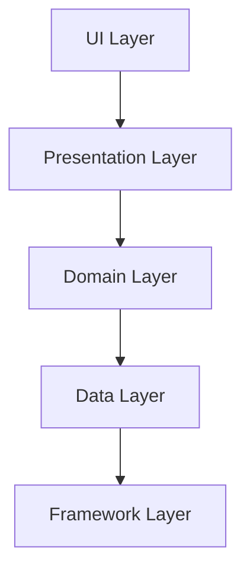

# 🧼 Clean Architecture in Android

## 📘 Overview

**Clean Architecture** is a software design pattern introduced by **Robert C. Martin (Uncle Bob)**. It promotes separation of concerns and independence of frameworks, UI, databases, and other external agencies. This makes the application more maintainable, testable, and scalable.

---

## 🧱 Layered Structure



---

## 🧩 Layers Explained

| Layer         | Responsibility |
|---------------|----------------|
| **UI**        | Displays data and observes `ViewModel` or `Presenter`. |
| **Presentation** | Handles user actions, communicates with UseCases. ViewModel lives here. |
| **Domain**    | Contains business rules. UseCases are defined here. Framework-independent. |
| **Data**      | Implements repository interfaces defined in Domain. Talks to network or local DB. |
| **Framework** | Includes actual implementations like Room, Retrofit, Firebase, etc. |

---

## 📦 Package Structure (Example)

```
com.example.app
├── presentation
│   └── viewmodel, ui, state
├── domain
│   └── usecase, model, repository
├── data
│   └── repository, api, db
├── di
│   └── modules for Hilt/Koin
└── utils
```

---

## 🔄 Data Flow

1. **UI** triggers an action (e.g., button click).
2. **ViewModel** calls a **UseCase**.
3. **UseCase** calls a **Repository** interface.
4. **Repository** is implemented in **Data Layer**.
5. **Data Source** (API/DB) is called.
6. Result is passed back to UI via ViewModel state.

---

## 🔐 Key Principles

- **Dependency Rule**: Inner layers should never depend on outer layers.
- **Inversion of Control**: Interfaces defined in inner layers and implemented in outer layers.
- **Testability**: Domain and UseCases are easy to test as they are framework-agnostic.

---

## ✅ Benefits

- Decoupled and modular architecture
- Easier to test each layer
- High maintainability
- Scales well for large applications

---

## ⚠️ Challenges

- May introduce boilerplate
- Learning curve for small teams
- Requires good understanding of abstraction and responsibility segregation

---

## 📘 Example UseCase

```kotlin
class GetUserProfileUseCase(private val repository: UserRepository) {
    suspend operator fun invoke(userId: String): UserProfile {
        return repository.getUserProfile(userId)
    }
}
```

---

## 🧠 Summary

Clean Architecture enforces **separation of concerns** and makes your app **robust and testable** by following a strict layered structure. It is ideal for large-scale applications and teams working on long-term maintainable Android projects.
