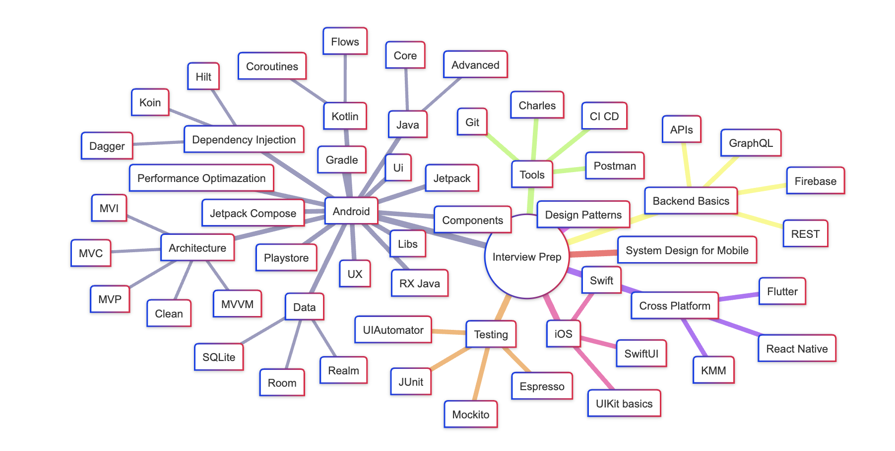

# 📱 DevCrack: Mobile Interview Preparation

A community-driven open-source repository to help mobile developers prepare for technical interviews. Covers Android, iOS, Flutter, KMM, system design, testing, architecture, and more!

## ✍️ Contributing

1. Fork the repo.
2. Create a folder or file in the appropriate section.
3. Add questions/answers in `Markdown`.
4. Submit a Pull Request.

See [CONTRIBUTING.md](./CONTRIBUTING.md) for more.

## 📝 License

[MIT License](./LICENSE)
